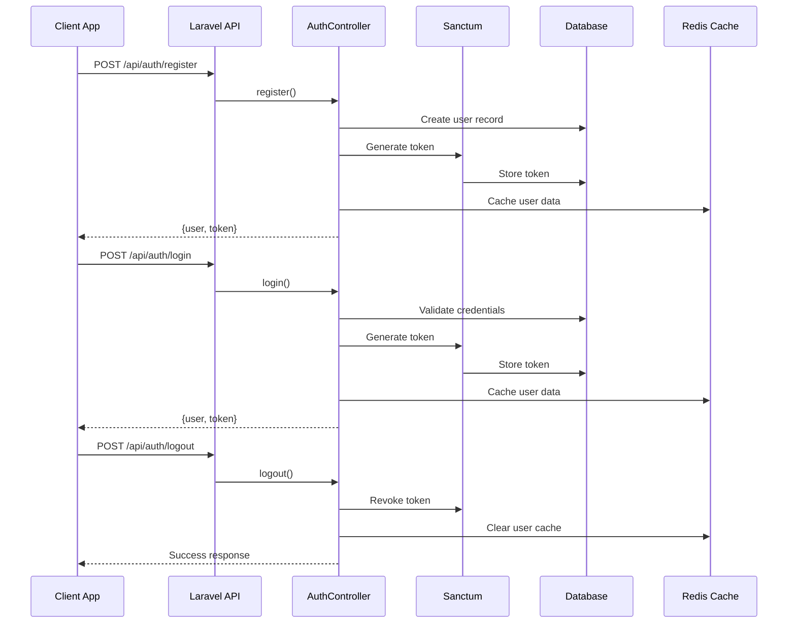
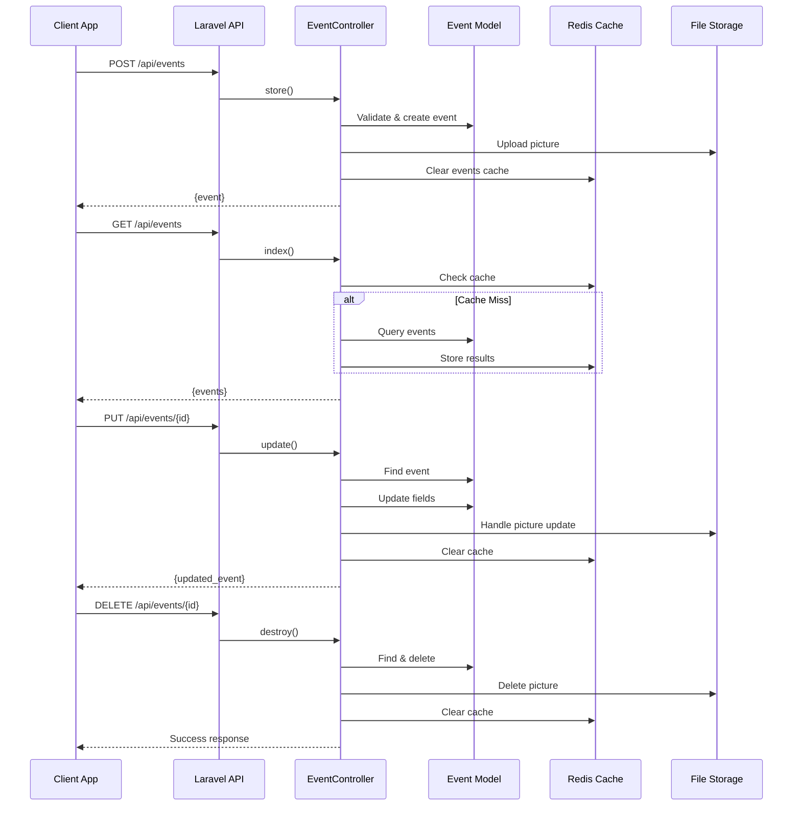
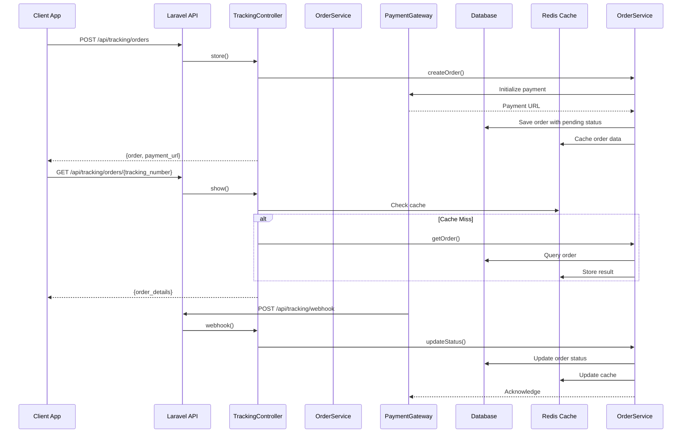
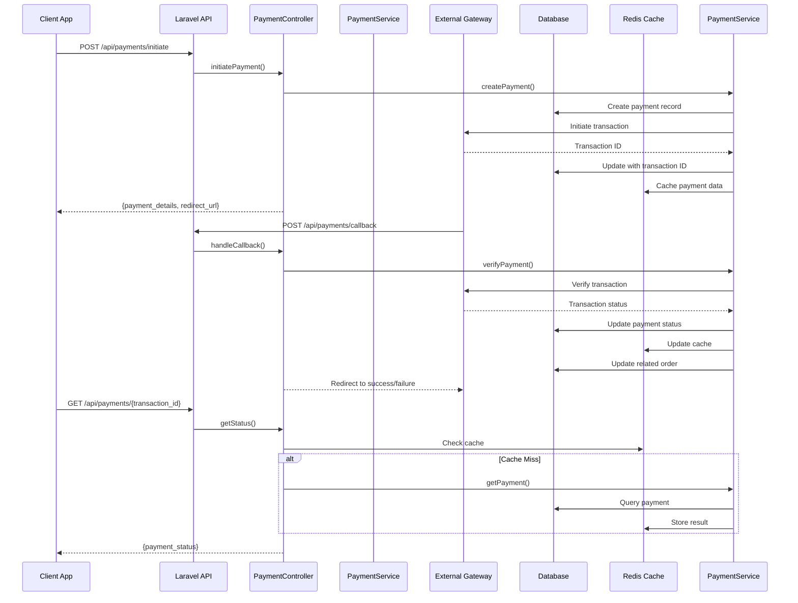
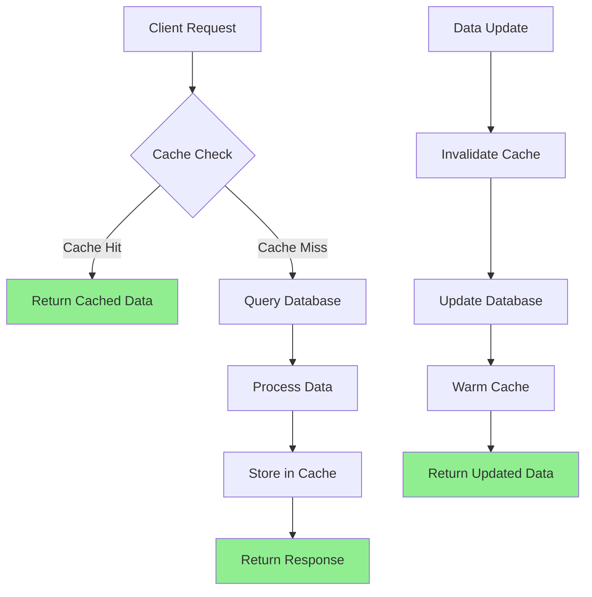
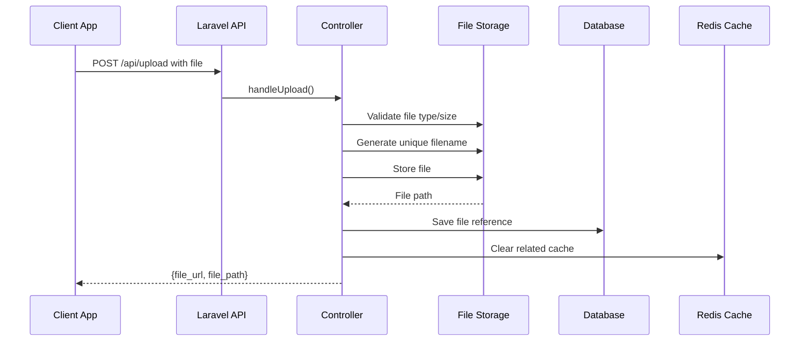
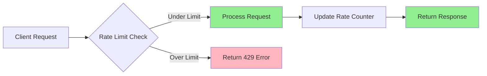
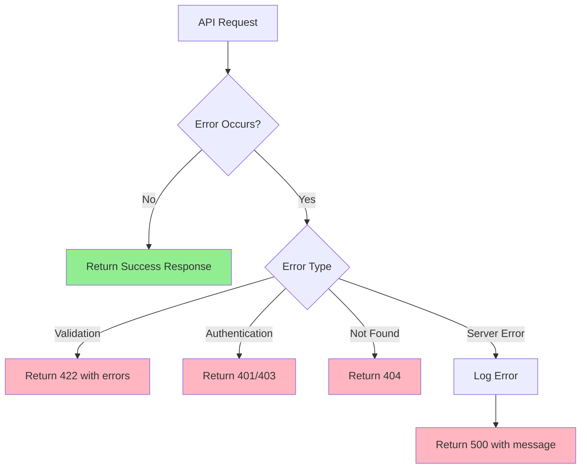
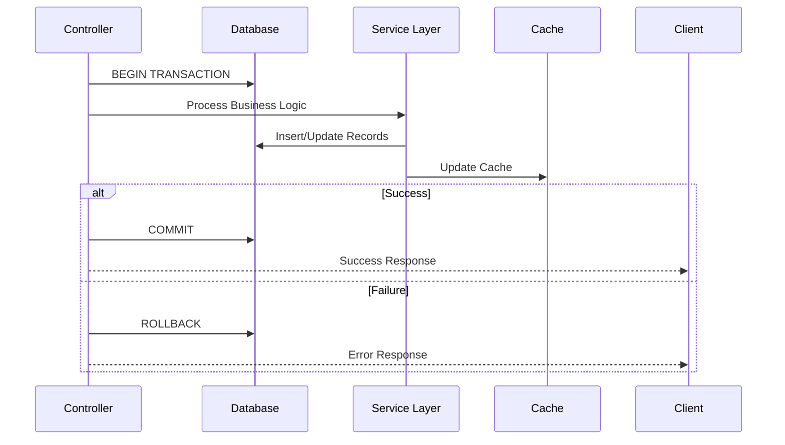
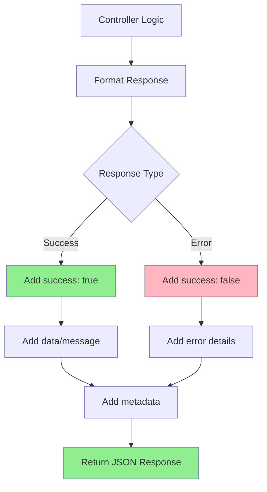

# Neema Gospel Data Flow Diagrams

## Overview
This document contains comprehensive data flow diagrams for the Neema Gospel Laravel application, covering authentication, event management, order tracking, and payment processing.

---

## 1. Authentication Data Flow

---

## 2. Event Management Data Flow

---

## 3. Order Tracking Data Flow

---

## 4. Payment Processing Data Flow

---

## 5. Cache Management Data Flow

---

## 6. File Upload Data Flow

---

## 7. API Rate Limiting Data Flow

---

## 8. Error Handling Data Flow

---

## 9. Database Transaction Flow

---

## 10. API Response Format Flow

---

## Key Data Flow Patterns

### **Caching Strategy**
- **Cache-aside pattern** for read-heavy operations
- **Cache invalidation** on data updates
- **Cache warming** for frequently accessed data

### **Error Handling**
- **Centralized exception handling** via Handler.php
- **Consistent error response format** across all endpoints
- **Detailed validation errors** for client-side handling

### **Security Flows**
- **Token-based authentication** with Laravel Sanctum
- **Rate limiting** per user/IP
- **Input validation** at controller level
- **File upload restrictions** (type, size, MIME)

### **Performance Optimizations**
- **Database indexing** on frequently queried fields
- **Eager loading** to prevent N+1 queries
- **Pagination** for large datasets
- **CDN integration** for static assets

### **Data Validation Flow**
1. **Client-side validation** (React app)
2. **API-level validation** (Form Requests)
3. **Database-level constraints** (migrations)
4. **Business rule validation** (service layer)
